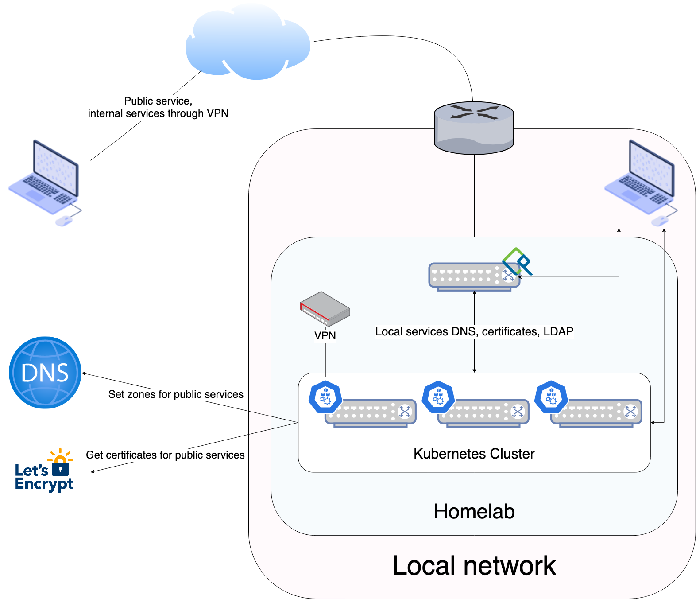

# tw0flower's homelab
This project is an attempt to automate the creation of self-hosted services all the way from basic OS provisioning the basic OS to deploying the end-user applications.

It project was inspired by [Khue's Homelab](https://github.com/khuedoan/homelab) and you should really check his project. While the end-goal is the same, I rely much more on Ansible, completely skip Terraform (at least for now) and try to not rely on external services. The only external services that I use are:
- A DNS provider supported by [ExternalDNS](https://github.com/kubernetes-sigs/external-dns)
- [Let's Encrypt](https://letsencrypt.org/) to generate certificates for external services

# Architecture
In addition to a Kubernetes cluster, I use FreeIPA to manage DNS and certificates for local services.

The homelab is made of the following systems:
- **FreeIPA instance**: provides a PKI infrastructure for local services certificates, local DNS and a LDAP backend that the applications can authenticate against
- **Kubernetes cluster**: provides a platform to run the applications

In addition, a VPN is installed on the Kubernetes cluster to provide access to the local network from the outside. Only applications that have explicitely been made public are available.

# Features
Below is a list of tentative features. Expectations will probably move along the way and some features are more of a priority to me than others.
- [ ] Basic public application deployment
- [ ] Automated DNS update for external services
- [ ] Basic internal application deployment
- [ ] Automated DNS update for internal services
- [ ] Automated certificate management for internal services
- [ ] Coordinated reboot/upgrade of kubernetes machines using [airlock](https://github.com/coreos/airlock)
- [ ] Virtualized testing and development environment

# Wouldn't have happened without them
I wouldn't be able to build this project if they hadn't published invaluable information on the different pieces of software that I use:
- How to set up Dynamic DNS on FreeIPA for your Kubernetes Cluster: https://astrid.tech/2021/04/18/0/k8s-freeipa-dns/
- ACME & FreeIPA – super easy: https://enotty.pipebreaker.pl/posts/2021/11/acme-freeipa-super-easy/
- This Github thread on how to execute wipefs before the CoreOS installer starts: https://github.com/coreos/coreos-installer/issues/947
